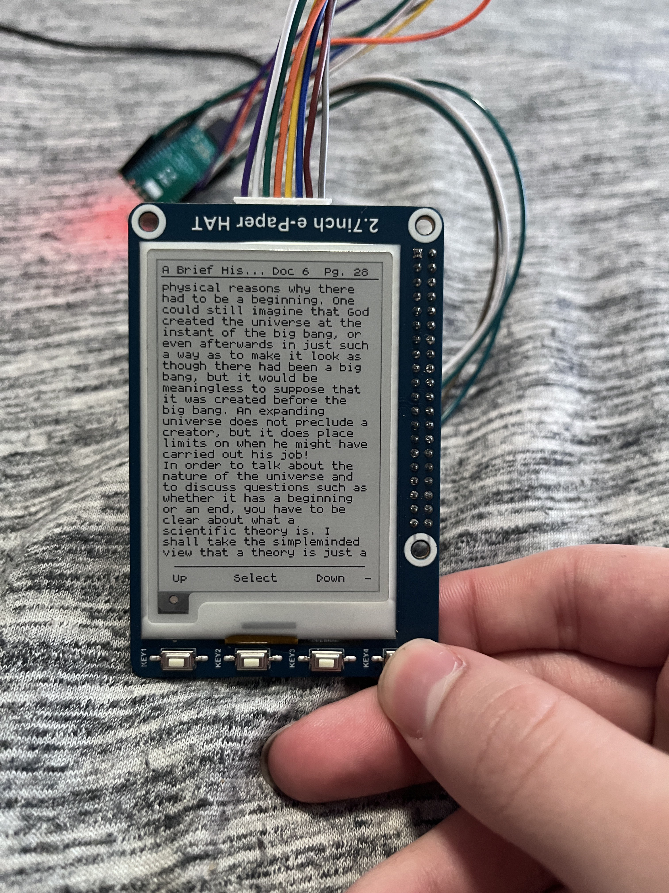

# PEPOS
Python E-Paper Operating System

PEPOS is an interpreted control program (with applications!) written in Python, designed to run on a [Waveshare 2.7" e-ink display](https://www.waveshare.com/2.7inch-e-paper-hat.htm).
*In the future, other Waveshare displays should work. I don't have any in my possession at the moment*

Powered by the [MilkV Duo](https://milkv.io/docs/duo/overview).

# IMPORTANT
**I have yet to push either of these**
This code alone will not work, it is dependent on a custom version of [Waveshare's e-paper driver](https://github.com/waveshareteam/e-Paper). This custom version supports the MilkV as supported hardware platform.
This custom driver also uses a custom version of [Pinpong](https://pypi.org/project/pinpong/) which has been **heavily** optimized for speed.

# Media

https://github.com/aiden3c/PEPOS/raw/master/docs/partial.mp4

https://github.com/aiden3c/PEPOS/raw/master/docs/launcher.mp4
